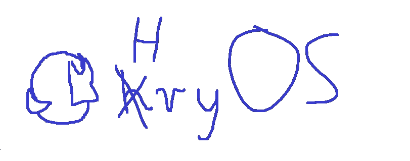

logo made by my dear friend [Knayder](https://github.com/Knayder)

# HryOS

HryOS is a simple operating system made as university project.

## Features
 
 - Multitasking with simple synchronization
 - Heap
 - Drivers for VESA and VGA text mode
 - Driver for keyboard
 - Logger to serial port
 - Simple shell

## [Download](https://github.com/Hary309/HryOS/releases/tag/1.0)

## Real hardware test

